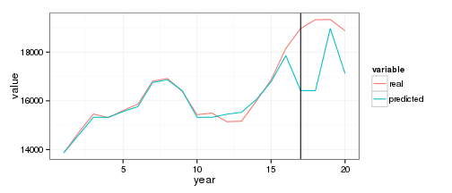

# Модель нечеткого прогнозирования распространения наркомании
(Fuzzy rule-based system based on space partition. 
Wang and Mendel’s technique (WM), 1992.)

 

Сравнение модели WM (predicted) с эмпирическими данными (real) с горизонтом прогнозирования = 3

|  predicted  |  real  |
|:-----------:|:------:|
|    16418    | 19328  |
|    18970    | 19337  |
|    17117    | 18876  |

Table: Значения модели и эмпирические значения

----------- -------
  **MSE**   3897863

 **RMSE**    1974  

 **SMAPE**   2.331 
----------- -------

Table: Оценки ошибок прогноза
