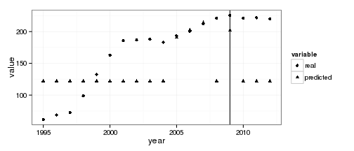

# Модель нечеткого прогнозирования распространения наркомании
(Fuzzy rule-based system based on space partition. 
Wang and Mendel’s technique (WM), 1992.)


```r
library(frbs)
library(knitr)
library(stringi)
library(xlsx)
library(pander)


path <- normalizePath(file.path("..", "data", "UA_enrollments.csv")) #we are in root folder, so '.'
tmp <- read.csv(path)
if(FALSE){
## load file
## we are in root folder, so '.'
path <- normalizePath(file.path("..", "data", 
                                "В состоянии наркотического опьянения.xlsx")) 
tmp <- read.xlsx(path, sheetIndex=1,header=T)

# cleaning
Sys.setlocale("LC_TIME", "ru_RU.utf8") 
names(tmp) <- stri_trans_general(names(tmp), 
                   "Any-Latin; nfd; [:nonspacing mark:] remove; nfc")
tmp$X.Vrema <- as.integer(tmp$X.Vrema <- substr(tmp$X.Vrema, start=0, stop=4))
}
```


```r
## Create dataset
## 22 records on UA enrollments
## input: enrollments(t-2), enrollments(t-1), 
## output: enrollments(t)
## horizon - number of points to forecast
horizon <- 3
start <- 1
finish <- nrow(tmp)
t <- tmp$enrollments[(start+2):finish]
tminus1 <- tmp$enrollments[(start+1):(finish-1)]
tminus2 <- tmp$enrollments[start:(finish-2)]
UA_enrollments <- data.frame(tminus2, tminus1 , t)

## Split the data to the training and testing datasets
finish <- nrow(UA_enrollments)

data.train <- UA_enrollments[start : (finish-horizon), ]
data.fit <- data.train[, 1 : 2]
data.tst <- UA_enrollments[(finish-horizon+1) : finish, 1 : 2]
real.val <- matrix(UA_enrollments[(finish-horizon+1) : finish, 3], ncol = 1)
range.data <- apply(data.train,2,range)
```

```r
## Set the method and its parameters
method.type <- "WM"
control <- list(num.labels = 15, type.mf = "GAUSSIAN", type.defuz = "WAM", 
                type.tnorm = "MIN", type.snorm = "MAX", 
                type.implication.func = "ZADEH",
                name="sim-0") 
```

```r
## Generate fuzzy model
object <- frbs.learn(data.train, range.data, method.type, control)

## Fitting step
res.fit <- predict(object, data.fit)

## Predicting step
res.test <- predict(object, data.tst)
```

Comparison WM Vs Real Value on UA Enrollments Data Set with Horizon = 3

```r
## Error calculation
y.pred <- res.test
y.real <- real.val
bench <- cbind(y.pred, y.real)
#sink(file = "Errors.txt", append = TRUE)
colnames(bench) <- c("pred. val.", "real. val.")
pander(bench, style="rmarkdown", caption="Значения модели и эмпирические значения")
```


|  pred. val.  |  real. val.  |
|:------------:|:------------:|
|    16418     |    19328     |
|    18970     |    19337     |
|    17117     |    18876     |

Table: Значения модели и эмпирические значения

```r
residuals <- (y.real - y.pred)
MSE <- mean(residuals^2)
RMSE <- sqrt(mean(residuals^2))
SMAPE <- mean(abs(residuals)/(abs(y.real) + abs(y.pred))/2)*100
err <- c(MSE, RMSE, SMAPE)
names(err) <- c("MSE", "RMSE", "SMAPE")
#print("Error Measurement: ")
pander(data.frame(err), type='rmarkdown', caption="Error measurement") 
```


-------------------
  &nbsp;      err  
----------- -------
  **MSE**   3897863

 **RMSE**    1974  

 **SMAPE**   2.331 
-------------------

Table: Error measurement

```r
#print(" ") ##FILECONN!!!
```

```r
## Comparing between simulation and real data
op <- par(mfrow = c(2, 1))
x <- 1:20
y <- t
y1 <- rbind(res.fit, res.test)
result.fit <- cbind(data.train[, 3], res.fit)
result.test <- cbind(real.val, res.test)
plot(x, y, col="red", main = "Enrollments \n(Real data(red) Vs Sim. result(blue))", 
     type = "l", ylab = "Enrollments")
lines(x, y1, col="blue")
abline(v=20-horizon)


par(op)
```

 
